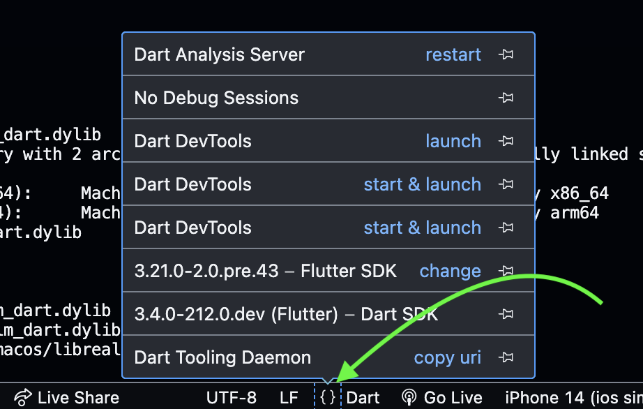

# Contributing

## Filing Issues

Whether you find a bug, typo or an API call that could be clarified, please [file an issue](https://github.com/realm/realm-dart/issues) on our GitHub repository.

When filing an issue, please provide as much of the following information as possible in order to help others fix it:

1. **Goals**
2. **Expected results**
3. **Actual results**
4. **Steps to reproduce**
5. **Code sample that highlights the issue** (full Flutter or Dart project that we can run ourselves are ideal)
6. **Version of Realm, Flutter and Dart**
7. **Version of desktop OS - Mac, Windows or Linux**
8. **Version of target mobile OS**

If you'd like to send us sensitive sample code to help troubleshoot your issue, you can email <help@realm.io> directly.

## Contributing Enhancements

We love contributions to Realm! If you'd like to contribute code, documentation, or any other improvements, please [file a Pull Request](https://github.com/realm/realm-dart/pulls) on our GitHub repository. Make sure to accept our [CLA](#CLA).

### CLA

Realm welcomes all contributions! The only requirement we have is that, like many other projects, we need to have a [Contributor License Agreement](https://en.wikipedia.org/wiki/Contributor_License_Agreement) (CLA) in place before we can accept any external code. Our own CLA is a modified version of the Apache Software Foundation’s CLA.

[Please submit your CLA electronically using our Google form](https://docs.google.com/forms/d/1ga5zIS9qnwwFPmbq-orSPsiBIXQjltKg7ytHd2NmDYo/viewform) so we can accept your submissions. The GitHub username you file there will need to match that of your Pull Requests. If you have any questions or cannot file the CLA electronically, you can email <help@realm.io>.

## Building from source

> [!NOTE]
> If you want to enable switching between different Flutter and Dart versions in your local environment, see section [Switching between versions of Flutter and Dart](#switching-between-versions-of-flutter-and-dart) for instructions on how to install those SDKs.

### Clone the repo

```shell
git clone https://github.com/realm/realm-dart
cd realm-dart
git submodule update --init --recursive
```

### Install and activate [melos](https://melos.invertase.dev)

```shell
dart pub global activate melos
```

Make sure that `~/.pub-cache/bin/` is added to your `PATH`. Otherwise you need to prefix the following `melos` commands with `dart pub global run`.

```
# In e.g. `~/.zshrc`
export PATH="$PATH":"$HOME/.pub-cache/bin"
```

### Set up the project

```shell
melos bootstrap
melos run setup
```

### Build artifacts

```shell
melos run build
```

To only build the native code for a specific target (see available target names in [build.dart](./packages/realm_dart/dev/lib/src/build.dart)), run:

```shell
cd packages/realm_dart
# Example using `macOSArm64` as target and debug mode.
dev build -m debug -t macOSArm64
```

### Run all tests

```shell
melos run test
```

If having multiple Flutter/Dart versions installed, [switch](#switch-versions) to the flutter `master` branch when running the tests.

In some cases, you may need to increase the number of possible file descriptors to use:

```shell
ulimit -n 2048
```

> [!TIP]
> There are many more melos scripts available to customize what to build and test. See [melos.yaml](melos.yaml) for details.

## Running emulators/simulators

List all the available emulators/simulators:

```shell
flutter emulator
```

Launch one of the emulators, e.g.:

```shell
flutter emulators --launch apple_ios_simulator
```

## Switching between versions of Flutter and Dart

### Install Flutter and Dart

Create a directory called `flutter` somewhere on your machine (in this example we create it inside the directory `~/development`):

```shell
cd ~/development
mkdir flutter
cd flutter
```

Clone the Flutter repo and name it `master`:

```shell
git clone git@github.com:flutter/flutter.git master
cd master
```

Create Git worktrees for a `stable` branch and `beta` branch:

```shell
git worktree add ../stable stable
git worktree add ../beta beta
```

Run the Flutter executable:

```shell
# In `master`
cd bin
./flutter
```

### Define the current branch

Use a branch to represent the version of Dart you are currently working on by creating a symlink to point `current` to the `stable` branch:

```shell
ln -s stable current
```

### Update the PATH environment variable (env)

Add the path to where `bin` is located in the `current` branch:

```
export PATH=$PATH:<path to flutter>/current/bin

# Example
export PATH=$PATH:$HOME/development/flutter/current/bin
```

Restart your terminal (or run `source <path to profile file>`) to load the new env.

### Update VS Code settings

> [!NOTE]
> Make sure you have our [recommended VS Code extensions](./.vscode/extensions.json) installed.

1. Open the `realm-dart` root directory in VS Code and open any `.dart` file.
2. Press <kbd>Shift</kbd>+<kbd>Cmd</kbd>+<kbd>P</kbd> to open the Command Palette.
3. Type `open settings`.
4. Select `Preferences: Open Settings (UI)`.
3. Type `dart flutter sdk paths` (using **plural** "paths" rather than "path").
4. Under `Dart: Flutter Sdk Paths`, click `Add Item`.
5. Enter the path to the `flutter` directory. Example: */Users/janedoe/development/flutter*
6. To confirm that it was added, open the Command Palette again, then type `open settings` and select `Preferences: Open Settings (JSON)`. `"dart.flutterSdkPaths"` should be defined (remove any entry with the singular `"dart.flutterSdkPath"`). Example:
```jsonc
{
    // ...
    "dart.flutterSdkPaths": [
        "/Users/janedoe/development/flutter"
    ],
}
```

### Switch versions

1. Navigate to any `.dart` file.
2. In the lower right corner in VS Code, click on the `{}` icon next to `Dart` and select which version to change (see screenshot):


